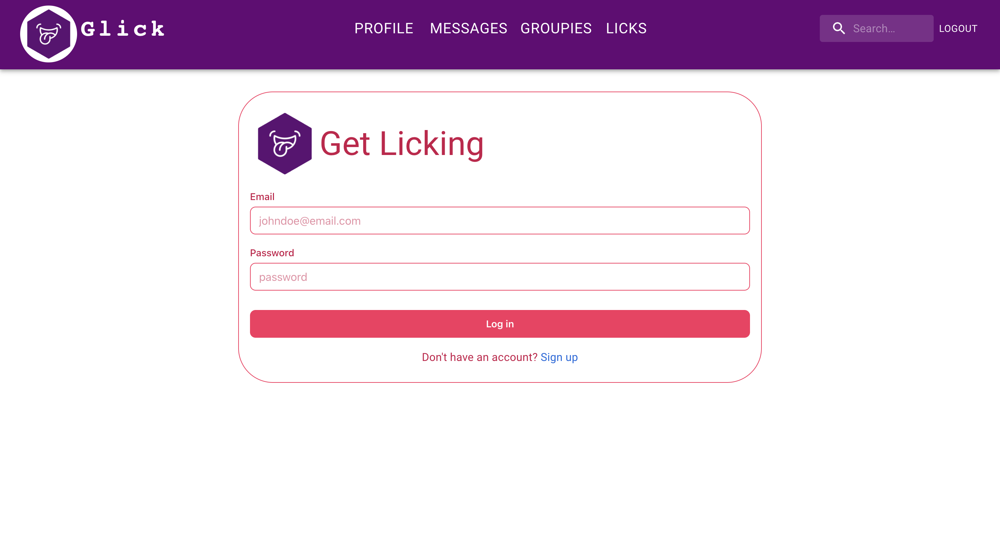
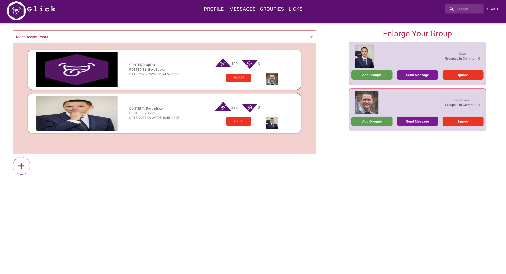

## Description
Previously known as GroupieLicks, Glick is a responsive and secure Facebook inspired social media site built using MongoDB, Express, React and Node.js where users create and delete posts, share photos, and uplick and downlick content.

## Setup & Installation

**Clone the Glick app from GitHub and navigate to the directory:**

   First, make sure you have Git installed on your machine. If not, [download and install Git](https://git-scm.com/downloads).

   Now, clone the Glick repository by using the following command in your terminal:
   
   ```
   git clone https://github.com/BoydBLever/Glick.git
   ```


Once the repository has been cloned, navigate to the main directory:

```
cd Glick
```


Split your terminal into two panes (how you do this depends on your terminal software; for many terminals, right-clicking or using a menu option will give you the option to split the pane). 

In the left-hand pane, navigate to the `client` directory:

```
cd client
```


In the right-hand pane, navigate to the `server` directory:

```
cd server
```

You're now set to operate in both directories simultaneously.

***Install dependencies in both terminals:***
```
npm install
```

In the right-hand terminal, enter this command:
```
node server.js
```
In the left-hand terminal, enter this command:
```
npm start
```

### Run the Application
After executing the start commands, the React development server will start, and Glick will automatically open in [http://localhost:3000/](http://localhost:3000/). For the best user experience, open the app in Google Chrome. Behold the beauty and power of Glick!

### Database Mapping
In order to browse collections and documents created by Glick users, you will need to interact with the storage database. You may also perform important operations like querying and editing.

To interact with this local database, use the **MongoDB Compass GUI**. Download the full version with all features and capabilities [here](https://www.mongodb.com/try/download/compass).

Last but not leaset, connect to a local MongoDB instance with a database named `groupie_licks_db` on the default MongoDB port on `localhost`. The connection string as determined by the mongoose configuration in `mongoose.config.js` is `mongodb://localhost/groupie_licks_db`.

## Screenshots:

### 1. Login:


### 2. Signup:


### 3. User-Profile:


### 4. Cook-Up-A-Post:


### 5. Landing:


### 6. Profile-Posts:


### 7. MongoDB-Compass-Users:


